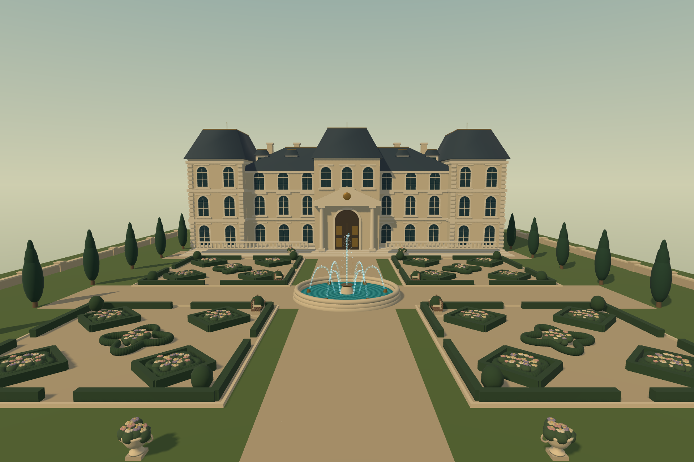

# Domaine de Plaisance

Un château de plaisance, quatre jardins à la française et une fontaine animée à **six jets latéraux et un jet central**, à visiter ensemble sur navigateur ou en VR.



```sh
npm install
npm run dev
```

Ouvrir l'adresse affichée par IWSDK. Marcher avec WASD (ZQSD sur clavier français) ou les flèches ; glisser sur la vue pour regarder. En VR, utiliser les joysticks. **Copier le lien du salon** pour inviter jusqu'à12 personnes au total.

Pour entrer en VR, ouvrir le lien HTTPS du domaine dans le navigateur du casque, puis cliquer sur **Entrer en VR** dans le panneau de gauche et accepter la demande du navigateur. Ce bouton fait partie de l'application et reste visible même quand le navigateur ne propose pas son propre bouton « Enter XR ». Un message précise si aucun casque compatible n'est disponible.

Sur **mobile ou tablette**, les commandes tactiles apparaissent automatiquement : joystick à gauche pour marcher, glissement dans la zone de droite pour regarder. Les deux gestes fonctionnent simultanément. Les boutons **Domaine**, **Confort** et **Amis** ouvrent les informations/l'entrée VR, les réglages et le partage du salon. Refermer le panneau avec le même bouton pour reprendre la promenade. Le déplacement s'arrête au relâchement, à l'annulation d'un geste, au changement d'orientation ou à l'ouverture d'un menu. L'interface tient compte des encoches et s'adapte au portrait/paysage. Ces commandes sont réservées aux téléphones et tablettes. Elles sont masquées sur ordinateur, même tactile, et dans les navigateurs de casque VR.

**Menu de confort : M au clavier, B sur la manette droite en VR.** La même touche referme le menu ; le bouton Fermer et Échap fonctionnent aussi. Choisir l'intensité de l'effet tunnel : 0 % (désactivé), 25 %, 50 %, 75 % ou 100 %. Cliquer à la souris ou viser un bouton puis presser brièvement la gâchette en VR. Au clavier, les touches 0 à 4 sélectionnent ces cinq niveaux lorsque le menu est ouvert. Le réglage s'applique immédiatement et reste mémorisé sur cet appareil, indépendamment des autres visiteurs.

```sh
npm run typecheck
npm run test:rooms
node --test tests/comfort-menu.test.mjs
node --test tests/mobile-input.test.mjs tests/mobile-controls.test.mjs
npm run build
npm start
```

`npm start` sert la version compilée et les salons sur le port8081 (`PORT` configurable). Les visites entre amis à distance exigent un hébergement public HTTPS/WSS : voir [le guide multijoueur](README-multiplayer.md).

La scène modifiable est `public/scenes/plaisance.iwsdk.scene.json`, sélectionnée par `iwsdk.config.json`. Ses modèles sont dans `src/scene-assets/`. Les fichiers de composition/modules sont les sources de construction initiales ; poursuivre les modifications dans la scène aplatie, sans la régénérer par-dessus les modifications de l'éditeur.

[Rapport de vérification](design/VERIFICATION.md) · [Présentation du domaine](design/deck.html)
