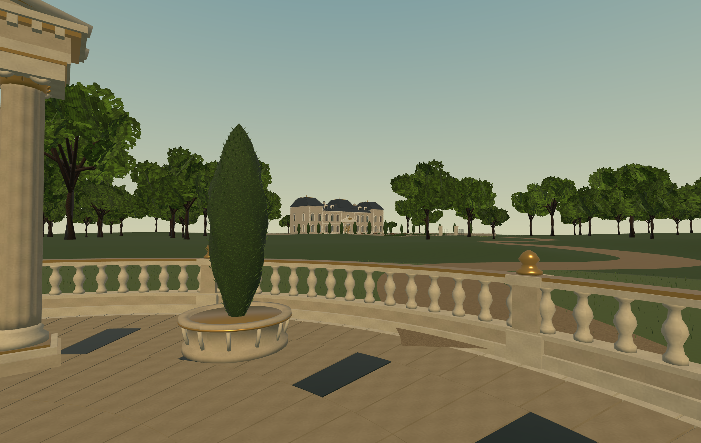
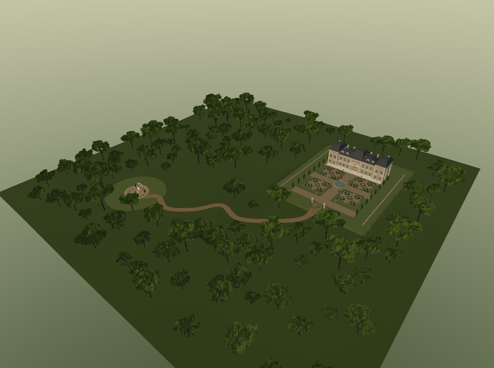

# Paysage de l'accueil implemente

Le plan valide est integre dans `public/scenes/arrival.iwsdk.scene.json`.
Tous les noeuds de l'accueil preexistant, leurs transformations, le panneau et
le point de depart `[0, 0, 2]` sont conserves. La scene `plaisance` est identique
a sa sauvegarde avant intervention.

## Implantation

- Terrain de 240 x 240 m : X -70 a 170, Z -180 a 60. Relief doux hors des zones planes.
- Domaine deplace en bloc de `[100, 0, -95]`, sans rotation ni changement d'echelle.
  Le chateau est centre autour de `[100, 0, -123]`, a environ 160 m de l'accueil.
- 51 placements exterieurs repris : chateau, vitrages, entree, parterres, allees,
  bancs, vases, cypres, clotures et bassin. Aucun fichier de mobilier interieur,
  buste, miroir, cheminee ou avatar n'est importe dans cette copie.
- Eau de la fontaine animee par les composants existants, decales avec le domaine.
- Chemin de gravier de 3,6 m, elargi a 7 m au portail, raccorde en `[100, 0, -68]`
  a l'allee centrale. Les brins d'herbe du raccord sont retires sur la copie distante.
- 132 chenes : trois silhouettes, deux niveaux de detail, tailles variables et
  couloir visuel degage vers le chateau. Aucun arbre dans le domaine ou sur le chemin.
- Place circulaire protegee par 96 segments invisibles chevauchants. Le mur est
  enregistre dans Locomotor ; un controle supplementaire replace le joueur apres
  une chute ou un deplacement physique du casque hors de la place. Il compense
  le decalage du casque dans l'espace de jeu.

## Modelisation et fichiers

Les nouveaux objets et textures sont generes dans une scene Blender distincte via
le MCP local. Les fichiers originaux ne sont pas remplaces. La telemetrie du MCP
est desactivee dans `scripts/blender-mcp.mjs`, avec les options prises en charge
par le serveur installe, y compris pour les captures de session.

- Source : `artifacts/arrival-landscape/accueil-paysage.blend`.
- Exports : `public/gltf/arrival-landscape/`.
- Generation complete : `scripts/blender-arrival-landscape.py` via le MCP Blender.
- Composition : `scripts/integrate-arrival-landscape.mjs`.
- Positions et mesures : `artifacts/arrival-landscape/`.

Les feuilles utilisent des rameaux courbes avec atlas de feuilles lobees et
materiaux glTF `MASK` : decoupe alpha, sans transparence melangee. Les textures
sont embarquees dans les GLB. La foret est regroupee en 16 secteurs pour limiter
les appels de rendu tout en permettant l'elimination des secteurs hors champ.

| Nouveau decor | Triangles |
| --- | ---: |
| Foret complete | 84 432 |
| Chateau et jardin distants | 116 142 |
| Terrain | 28 800 |
| Chemin | 288 |
| Portail | 336 |

Les cinq GLB utilises par le decor representent environ 12,94 Mo au total.
Les six fichiers de chenes individuels restent disponibles comme sources
reutilisables ; l'application charge la foret assemblee.

## Verification

- `npx tsc --noEmit` : reussi.
- Tests accueil, paysage et protection : **19 reussis** (`tests-final.txt`).
  Ils couvrent notamment les placements preserves, les exclusions de la foret,
  les materiaux embarques, 768 rayons autour du mur et le moteur Locomotor reel
  contre le mur dans 16 directions.
- VR emulee Quest 3 : environnement de collision initialise, marche au joystick
  bloquee dans la place, sortie physique simulee recuperee. Le compteur passe de
  0 a 1 et l'origine compense les 10 m de decalage du casque (`runtime-recovery.json`).
- Rendus natifs valides : `vista.png`, `overview.png` ; capture en VR emulee :
  `vr-spawn.png`. Etat final sans conflit, runtime pret et conforme au hash attendu
  (`final-scene-state.json`).
- Vue du domaine : 143 appels et 341 848 triangles rendus, decor initial et eau
  compris. Mesures sur navigateur Windows / Intel Iris Xe, pas sur un Quest physique.
- `npm run build` : reussi, avec l'avertissement existant sur la taille du bundle.

La verification elargie de `static-collision.test.mjs` passe 11 de ses 12 cas.
Son ancien inventaire de 49 solides echoue sur `palaceInterior`, absent de son
catalogue de prototypes. Ce cas ne lit que la scene `plaisance`, conservee a
l'identique ; il ne teste pas les ajouts de l'accueil. Cette limite est conservee
dans `tests.txt`, sans masquer l'echec ni modifier le chateau pour satisfaire le test.

