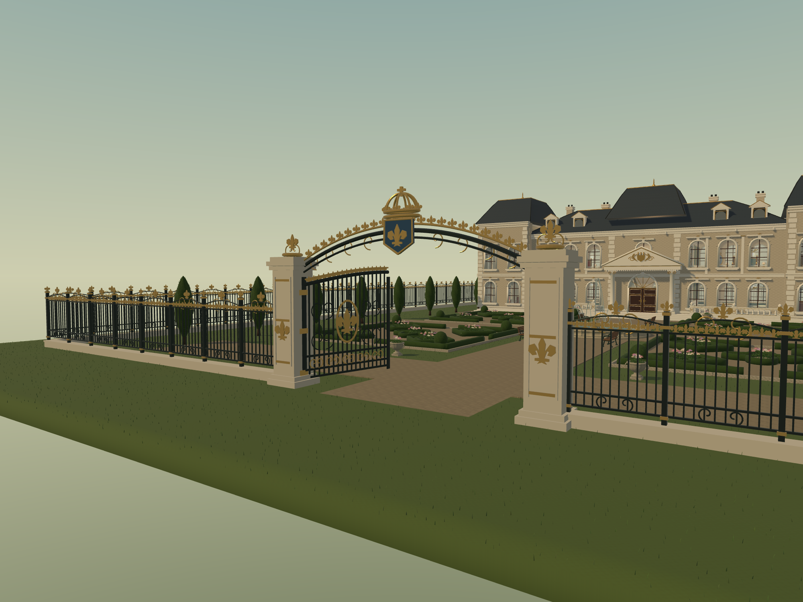
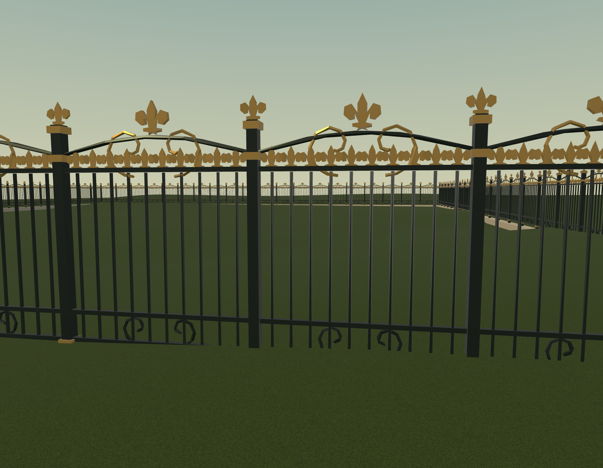
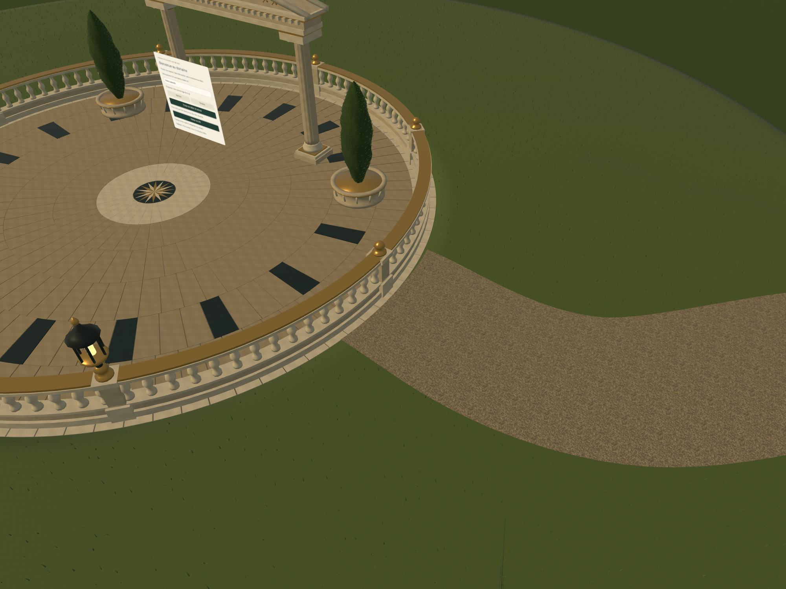
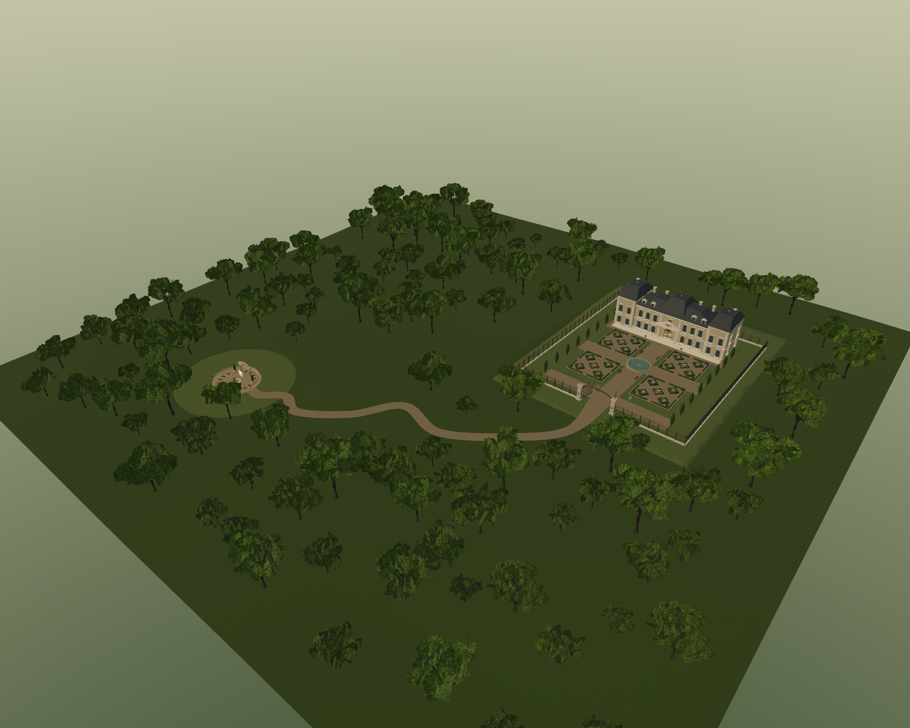

# Portail royal, enceinte et raccord du gravier

Correction de septembre 2026 : le petit portail et les anciens murets sont
remplaces dans les deux scenes. L'accueil conserve tous ses elements et son spawn.

- Portail de 8,52 m au couronnement : piliers moulures, arche en fer forge, couronne
  en volume, blason bleu, fleurs de lys dorees, medaillons et volutes sur les vantaux.
- Vantaux ouverts a 78 degres : plus de 8 m libres au passage le plus etroit.
- Enceinte sur les quatre cotes du domaine, X = +/-30 m, Z = -40 a 30 m.
  82 panneaux ornes, environ 4,27 m de haut ; plinthes de pierre, ferronnerie noire,
  volutes, fleurs de lys sur chaque barreau et couronnements au-dessus des panneaux.
- Collisions simplifiees sur les quatre cotes, les piliers et les vantaux ouverts.
  L'ouverture centrale reste traversable dans la scene du chateau.
- Depart du chemin decoupe sur un arc de rayon 8,025 m : aucun triangle de gravier
  n'entre dans le cercle de 8 m. La place et son mur invisible restent en position.
- Les images de couleur et de normales du gravier sont reprises sans modification
  depuis `pathLong.glb` : leurs SHA-256 sont identiques. Rugosite conservee et UV
  calcules a l'echelle physique de l'allee centrale. Raccord de gravier ajoute sous
  le portail et brins d'herbe retires sur une copie de la pelouse a cet endroit.

Sources Blender, creees via le MCP local avec telemetrie desactivee :

- `artifacts/royal-enclosure/portail-royal-et-enceinte.blend`
- `artifacts/royal-enclosure/exterieurs-sans-murets.blend`

Generation : `scripts/blender-royal-enclosure.py`, puis
`scripts/blender-royal-estate-copy.py`. Integration :
`scripts/integrate-royal-enclosure.mjs`. Les anciennes sources du chateau et de
l'accueil ne sont pas ecrasees ; les nouvelles ressources sont sous
`public/gltf/royal-enclosure/`. Le pipeline de regeneration de l'accueil appelle
egalement ces corrections.

| Modele | Triangles |
| --- | ---: |
| Portail proche | 25 404 |
| Enceinte proche complete | 121 890 |
| Portail lointain | 12 702 |
| Enceinte lointaine complete | 47 640 |

Verification : TypeScript et build de production reussis ; 23 tests reussis
(`artifacts/royal-enclosure/tests-final.txt`). Ils couvrent les images du gravier,
les triangles du raccord, la presence des deux enceintes, les hauteurs, la
conservation de la place et les collisions, y compris le moteur Locomotor reel.
Rendus natifs valides du portail dans la scene du chateau, de la cloture isolee,
du raccord circulaire et de la vue d'ensemble de l'accueil. Etat final sans conflit,
runtime pret ; les deux entites royales sont presentes dans l'application.
La fluidite sur un Quest 3 physique n'a pas ete mesuree.

